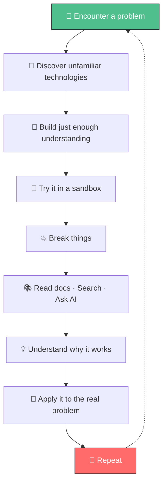

  

  

 

  

 

## 🧰 Tech Arsenal

### Languages

 

### Frontend

 

### Backend

 

### AI / ML

 
<i>Focus: Agentic AI · MCP · RAG · Context Engineering</i>

### Databases & Storage

 
<i>Also: PGVector (Postgres extension)</i>

### DevOps, Infra

 

### OS

### Tools & IDE

 

## 💫 About Me

<table>
<tr>
<td width="60%" valign="top">

### 👨‍💻 **Who I Am**

**Xuan-You Lin (林宣佑)**  
🎓 **AI Engineer & Software Architect | M.S. in AI**  
📚 M.S. in Artificial Intelligence @ National Ilan University (2026 – Present)  
📚 B.Eng. in CSIE @ National Ilan University (2022-2026)  

---

### 💼 **Current**

🔬 **Researcher** @ NIU VoIP Lab

---

### 📜 **Previous Experience**

🤖 AI Developer @ [LaplaceAI](https://laplaceai.co/)  
🔬 R&D Intern @ ROC Computer Skills Foundation  
🎓 Research Project Leader — AI Learning Assistant  
🎯 Team Leader — K12EDU Platform  
*→ details in Professional Experience below*

 

</td>
<td width="40%" align="center" valign="top">

</td>
</tr>
</table>

### 🎯 **What I Do**

<table>
<tr>
<td align="center" width="50%">

#### 🤖 **Agentic AI Systems**

Building production-grade LLM apps — autonomous agents, RAG pipelines and context engineering

</td>
<td align="center" width="50%">

#### 🏗️ **Systems & Infra Architecture**

Secure, lightweight systems — Rust services, container isolation, Linux internals from network to GPU

</td>
</tr>
<tr>
<td align="center" width="50%">

#### 💻 **Full-Stack Engineering**

Minimal, fast web apps — Svelte-first frontend, Python backends, containerized deployment

</td>
<td align="center" width="50%">

#### 🚀 **Technical Leadership**

From architecture to production — leading teams that ship reliable, scalable systems

</td>
</tr>
</table>

 

  

 

## 🧭 Learning Philosophy

🧭 <b>View Learning Philosophy</b> — <i>Learning loop & how I learn</i>

 

<i><b>I don't try to know everything. I try to become good at entering unfamiliar territory.</b></i>
 
I learn primarily through <b>problems, exploration, and iteration</b> rather than following a predefined curriculum.

 

### 🔁 Learning Loop

```mermaid
flowchart TD
    A[🎯 Encounter a problem] --> B[🔭 Discover unfamiliar technologies]
    B --> C[🧩 Build just enough understanding]
    C --> D[🧪 Try it in a sandbox]
    D --> E[💥 Break things]
    E --> F[📚 Read docs · Search · Ask AI]
    F --> G[💡 Understand why it works]
    G --> H[🚀 Apply it to the real problem]
    H --> I[🔁 Repeat]
    I -.-> A

    style A fill:#4FC08D,stroke:#0D1117,color:#fff
    style I fill:#FF6B6B,stroke:#0D1117,color:#fff
```

### 🌱 How I Learn

<table>
<tr>
<td align="center" width="25%">

#### 🔭 Discover Broadly

Use videos, articles, and projects as a technical radar

</td>
<td align="center" width="25%">

#### 🎯 Learn When Needed

No pre-memorizing everything before using it

</td>
<td align="center" width="25%">

#### 🛠️ Build First

Hands-on experimentation exposes what I actually need

</td>
<td align="center" width="25%">

#### 📚 Go to the Source

When it breaks, read docs and investigate the mechanism

</td>
</tr>
</table>

<table>
<tr>
<td align="center" width="33%">

#### 🤖 AI as Accelerator

AI navigates docs, compares approaches, explores domains — I validate the result

</td>
<td align="center" width="33%">

#### ⏩ Skip Known

Skim or skip familiar material, spend time on unknowns

</td>
<td align="center" width="33%">

#### 🧪 Sandbox First

Experiment freely isolated, then move validated solutions to real systems

</td>
</tr>
</table>

 

> *"The goal isn't to know everything. The goal is to be able to learn whatever becomes necessary. ⚡"*

 

  

 

## 🎓 Education & Experience

📚 <b>View Education & Professional Experience</b>

 

<table>
<tr>
<td width="30%" align="center" valign="top">

### 🎓 Education

**M.S. in Artificial Intelligence**

*National Ilan University*

📅 2026.09 – Present

---

**B.Eng. in Computer Science**
 **& Information Engineering**

*National Ilan University*

📅 2022.09 – 2026.06

---

</td>
<td width="70%" valign="top">

### 💼 Professional Experience

<table>
<tr>
<td>

#### 🔬 **Researcher** @ NIU VoIP Lab
📅 2026.09 – Present  
🎯 **Agentic AI** — *CLI vs MCP* research from the ground up  
💡 Core focus: Agentic AI | Personal passion: Systems / Infra

</td>
</tr>
<tr>
<td>

#### 🤖 **AI Developer** @ [LaplaceAI](https://laplaceai.co/)
📅 2025.05 – 2026.08  
🎯 AI agent development & integration

</td>
</tr>
<tr>
<td>

#### 🔬 **R&D Intern** @ ROC Computer Skills Foundation
📅 2025.10 – 2026.01  
🎯 AI Teaching Assistant System

</td>
</tr>
<tr>
<td>

#### 👨‍💻 **Research Project Leader**
📅 2025.07 – 2026.05  
🎯 Intelligent Learning Assistant & Gamified Platform  
💰 Funded by Ministry of Science (114-2813-C-197-023-E)

</td>
</tr>
<tr>
<td>

#### 🎯 **Team Leader & Developer** @ K12EDU Platform
📅 2023.11 – 2026.03  
👥 Cross-functional team  
🏆 **4+ National Awards** | 🚀 Multiple platform deployments

</td>
</tr>
</table>

</td>
</tr>
</table>

 

  

 

## 🚀 Featured Projects

🎓 <b><a href="https://github.com/k12edu">K12EDU Platform</a></b> – <i>AI-Powered Multi-Service Platform</i>

 

<table align="center">
<tr>
<td align="center" width="25%">

**🎮 Game Platform**
 

  
Gamified learning with achievements & leaderboards

</td>
<td align="center" width="25%">

**🤖 AI Assistant**
 

  
Intelligent tutoring powered by LLMs & RAG systems

</td>
<td align="center" width="25%">

**📝 Teacher Portal**
 

  
Comprehensive course & student management

</td>
<td align="center" width="25%">

**⚖️ Online Judge**
 

  
Automated code evaluation & testing system

</td>
</tr>
</table>

**🛠️ Tech Stack**

  

### 💡 Technical Highlights

<table>
<tr>
<td width="50%" valign="top">

#### 🤖 AI & Intelligence
**LLM-powered assistant with RAG**  
Advanced context engineering and retrieval-augmented generation for intelligent responses

 

#### 🚀 Real-time Processing
**Data pipeline & analytics**  
High-performance real-time data processing with scalable analytics infrastructure

 

#### 📊 Production Deployment
**Docker & CI/CD automation**  
Containerized deployment with continuous integration and delivery pipelines

</td>
<td width="50%" valign="top">

#### ⚙️ Architecture
**Microservices Architecture**  
Distributed system design with decoupled services for scalability and maintainability

 

#### 🔒 Security & Access
**Authentication & RBAC**  
Enterprise-grade authentication system with role-based access control

 

#### 🌐 Cloud Infrastructure
**Scalable & resilient**  
Cloud-native architecture designed for high availability and performance

</td>
</tr>
</table>

 

🦀 <b><a href="https://github.com/TsukiSama9292/OpenWorkspace-Engine">OpenWorkspace-Engine</a></b> – <i>Secure Lightweight Rust Container Orchestration</i>

 

  
<i>Turn idle servers into a secure, stable & efficient multi-tenant cloud development platform</i>

<table align="center">
<tr>
<td align="center" width="25%">

**🦀 Rust Powered**
 

  
Memory-safe high-performance orchestrator

</td>
<td align="center" width="25%">

**🔒 Secure Isolation**
 

  
gVisor + Docker multi-tenant hard isolation

</td>
<td align="center" width="25%">

**⚡ Lightweight**
 

  
Minimal overhead idle resource reclamation

</td>
<td align="center" width="25%">

**☁️ Cloud Platform**
 

  
On-demand dev workspaces at scale

</td>
</tr>
</table>

**🛠️ Tech Stack**

  

### 💡 Technical Highlights

<table>
<tr>
<td width="50%" valign="top">

#### 🦀 Systems Programming
**Rust orchestration engine**  
Secure, concurrent & memory-safe design for multi-tenant isolation without the weight of full K8s

 

#### 🔒 Security First
**gVisor (runsc) integration**  
Deep understanding of container runtimes — runc vs. gVisor for defense-in-depth sandboxing

 

#### 🌐 Network & OS Internals
**Linux networking & namespaces**  
Advanced networking, cgroups, namespaces and filesystem isolation tuning

</td>
<td width="50%" valign="top">

#### ⚡ Efficiency Driven
**Idle → Cloud in seconds**  
Reclaim idle servers, provision isolated workspaces on demand with minimal overhead

 

#### 🏗️ Infra Architecture
**Lightweight K8s alternative**  
Purpose-built for dev platform use-case — simpler, faster, lower resource than Kubernetes

</td>
</tr>
</table>

 

🖥️ <b><a href="https://github.com/TsukiSama9292/XFarm">XFarm</a> — <a href="https://github.com/TsukiSama9292/weston-14-patch">weston-14-patch</a></b> – <i>Docker-based Multi-Instance Linux Desktop & Game Farm</i>

 

  
<i>Android-emulator-like experience, but for Linux desktops & Steam games — fully containerized with passthrough</i>

<table align="center">
<tr>
<td align="center" width="25%">

**🖥️ Multi-Desktop**
 

  
Multiple isolated Linux desktops per host

</td>
<td align="center" width="25%">

**🎮 Steam Gaming**
 

  
Run multiple Steam games concurrently

</td>
<td align="center" width="25%">

**🎨 Custom Weston**
 

  
Patched compositor <a href="https://github.com/TsukiSama9292/weston-14-patch">weston-14-patch</a> for farm needs

</td>
<td align="center" width="25%">

**🎯 GPU Selector**
 

  
NVIDIA / AMD / Intel dGPU Intel / AMD iGPU Software

</td>
</tr>
</table>

**🛠️ Tech Stack**

  

### 💡 Technical Highlights

<table>
<tr>
<td width="50%" valign="top">

#### 🖥️ Graphics Stack Deep Dive
**Wayland / Weston rendering**  
Patched `weston-14-patch` to support multi-instance desktop compositing — deep Linux graphics knowledge

 

#### 🎮 Resource-Optimized Gaming
**Beyond emulator performance**  
Unlike Android emulators, tuned to fully utilize host resources for concurrent game execution

 

#### 🔧 GPU Passthrough
**Flexible GPU assignment**  
Per-container selection: NVIDIA / AMD / Intel discrete, Intel/AMD iGPU, or software rendering

</td>
<td width="50%" valign="top">

#### 🐳 Containerized Desktops
**Docker as isolation primitive**  
Full desktop environments containerized with device & GPU passthrough, not VM overhead

 

#### 📦 Reproducible Builds
**Nix + uv dependency pinning**  
Pin versions with known major bugs fixed — reproducible, hermetic environments

 

#### ⚙️ System-Level Engineering
**Networking + Display + Input**  
End-to-end plumbing of graphics, input, audio and network for N concurrent desktops

</td>
</tr>
</table>

 

  

 

## 🏆 Achievements & Recognition

<table>
<tr>
<td width="50%" valign="top">

### 🎯 **Competition Awards (2025)**

<table>
<tr>
<td align="center" width="60" style="font-size: 48px;">
🥇
</td>
<td>

**1st Place**  
College of EECS Capstone Competition  
*National Ilan University*

</td>
</tr>
<tr>
<td align="center" style="font-size: 48px;">
🥈
</td>
<td>

**2nd Place**  
Dept. CS & IE Capstone Competition  
*National Ilan University*

</td>
</tr>
<tr>
<td align="center" style="font-size: 48px;">
🏆
</td>
<td>

**Excellence Award**  
Programming & AI Applications Competition  
*National Ilan University*

</td>
</tr>
<tr>
<td align="center" style="font-size: 48px;">
🎖️
</td>
<td>

**Finalist**  
National College Innovation & Interdisciplinary Competition  
*Digital Computing & Innovation Track*

</td>
</tr>
</table>

</td>
<td width="50%" valign="top">

### 📜 **Professional Certifications**

<table>
<tr>
<td align="center" width="80">

</td>
<td valign="middle">

**Deep Learning Mechanics**  
*2023*

</td>
</tr>
<tr>
<td align="center">

</td>
<td valign="middle">

**AI on Jetson Nano**  
*2024*

</td>
</tr>
<tr>
<td align="center">

</td>
<td valign="middle">

**Building RAG Agents with LLMs**  
*2024*

</td>
</tr>
</table>

 

</td>
</tr>
</table>

 

  

 

## 🌐 Let's Connect!

  

 

  

